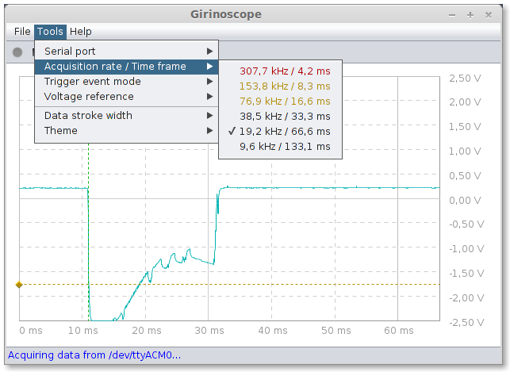

Girinoscope
===========

A simple graphical user interface for
[Girino, a Fast Arduino Oscilloscope](http://www.instructables.com/id/Girino-Fast-Arduino-Oscilloscope/)
running on Linux, Mac OS X and Windows.
The screen capture below, as well as the others in the `doc` folder,
displays the acquisition of a signal generated by various circuits including another DIY project:
[Skill Builder: Advanced Arduino Sound Synthesis](http://makezine.com/projects/make-35/advanced-arduino-sound-synthesis/).

Usage
-----

Since this little application is intimately bound to Girino,
the various settings provided by Girinoscope are not detailled here.
If you have already built your own Girino and studied the firmware,
you should already be familiar with them.

**Wait duration parameter**

The Arduino code provided in the [Girino Instructable]
(http://www.instructables.com/id/Girino-Fast-Arduino-Oscilloscope/)
doesn't handle very well the `wait duration` parameter that you can set using the vertical green rule
(the horizontal orange rule is for the threshold to trigger the acquisition).
There is a small bug when changing the value through the serial interface
which can easily be solved by applying the following patch manually:

_Girino.h, line 41:_

    // Replaced 3 by 4 since the wait duration range is [0, 1280[.
    #define COMBUFFERSIZE   4   // Size of buffer for incoming numbers

_Girino.ino, line 224:_

    // Added a necessary x2 factor since we read 16 bits now.
    delay(COMMANDDELAY * 2);

_Girino.ino, line 229:_

    // Replaced 'uint8' by 'uint16' for the same reason.
    uint16_t newT = atoi( commandBuffer );

With this simple correction, you should now be able to change the `wait duration` without problem.
However, remember that this duration is the time spent (or, more exactly, the number of data samples measured) by Girino _after_ the trigger.
Per instance, a `wait duration` of `580` gives you `1280 - 580` data measures before the trigger and `580` after.
If this trigger occurs too early, you will not see much from the past.
In fact, since Girino resets its data buffer on each acquisition, you will mostly get zeros.
The screen captures in the `doc` folder show some cases of such missing data
(since the observed signals are periodic, Girino can’t catch more than a period before a trigger occurs).

**Prescaler parameter**

The prescaler parameter also suffers some limitations signaled by the UI using the following colors:
- black if it should work without problem,
- orange if it won’t work without optimizing the Girino code,
- red if it won’t work at all (at least, it never did at home).

The code optimization consists in applying the [advices](doc/girino_optimization.md) given by [womai](http://www.instructables.com/member/womai/)
in the [Girino Instructable] (http://www.instructables.com/id/Girino-Fast-Arduino-Oscilloscope/).

Install
-------

Just unzip the [latest release](https://github.com/Chatanga/Girinoscope/releases) somewhere
and launch the application using the appropriate script at the root
(`girino` for Linux / Mac and `girino.bat` for Windows).
Of course, since this is a Java application, you need a [JRE 1.6 or higher](https://www.java.com/fr)
installed on your system (64 bits is currently only supported for the Linux version).
It shouldn’t be a problem on Linux and Mac, however, if you are an unfortunate Windows user
who don’t have it installed and don’t want to use the [shameful Oracle’s installer]
(http://news.techworld.com/applications/3423193/oracle-to-keep-bundling-crapware-with-java-installer/),
a fine solution is to use the one provided by the Arduino IDE.
In fact, provided you installed it in the default place, the launch script should find it.
If not, just edit the appropriate variable in the `girinoscope.bat` file.

Dependencies
------------

Girinoscope uses the same native library than the Arduino IDE 1.0.5 to manage serial port: the RXTX library.
It is not necessarily the perfect solution
and the latest Arduino IDE version (1.5.7 BETA) has droped it in favor of something more elaborate.
Whatever, the RXTX works well enough for our purposes and, if you have already successfully installed the Arduino IDE,
Girinoscope should work out of the crafting table.
Otherwise, there is all the informations you need on the [Arduino web site](http://arduino.cc/en/Guide/HomePage).

Build
-----

You just need a [JDK 1.6 or higher](http://www.oracle.com/technetwork/java/javase/downloads/index.html)
and [Ant](http://ant.apache.org/bindownload.cgi).
Nothing particular exotic in the Java world.
Once these tools installed, a simple `ant build` at the root of this project will do the job.
On success, you can run the application the same way by issuing a `ant run`.

Author
------

Florent Lioult

