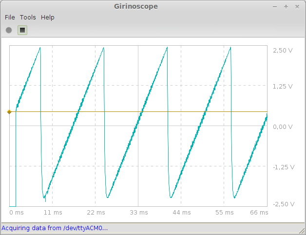

Girinoscope
===========

A simple graphical user interface for
[Girino, a Fast Arduino Oscilloscope](http://www.instructables.com/id/Girino-Fast-Arduino-Oscilloscope/).
The screen captures below display the acquisition of various signals generated by another DIY project:
[Skill Builder: Advanced Arduino Sound Synthesis](http://makezine.com/projects/make-35/advanced-arduino-sound-synthesis/).

Since this little application is intimately bound to Girino,
the various settings provided by Girinoscope are not detailled here.
If you have already built your own Girino and studied the firmware,
you should already be familiar with them.

**Warning**

The Arduino code provided in the [Girino Instructable]
(http://www.instructables.com/id/Girino-Fast-Arduino-Oscilloscope/)
doesn't handle very well the `wait duration` parameter that you can set using the vertical green rule
(if you wonder, the horizontal orange rule is for the threshold to trigger the acquisition).
There are a small bug when changing the value through the serial interface
which can easily be solved by applying the following patch manually:

*Girino.h, line 41:*

	// Replace 3 by 4 since the wait duration range is [0, 1280[.
	#define COMBUFFERSIZE   3   // Size of buffer for incoming numbers

*Girino.ino, line 229:*

	// Replace 'uint8' by 'uint16' for the same reason.
	uint8_t newT = atoi( commandBuffer );

Unfortunately, strange behaviors will happen when using it.
They can very well originate from the way I've built my Girino
and it definitely requires further investigations.

Build
-----

There are no binary package for the Girinoscope at this time, so you will need to build it yourself at home.
You just need a [JDK 1.6 or higher](http://www.oracle.com/technetwork/java/javase/downloads/index.html)
and [Ant](http://ant.apache.org/bindownload.cgi).
Nothing particular exotic in the Java world.
Once these tools installed, a simple `ant build` at the root of this project will do the job.
On success, you can run the application the same way by issuing a `ant run`.

Dependencies
------------

Girinoscope uses the same native library than the Arduino IDE 1.0.5 to manage serial port: the RXTX library.
It is not necessarily the perfect solution
and the latest Arduino IDE version (1.5.7 BETA) has droped it in favor of something more elaborate.
Whatever, the RXTX works well enough for our purposes and, if you have already successfuly installed the Arduino IDE,
Girinoscope should work out of the craft table.
Otherwise, there is all the informations you need on the [Arduino web site](http://arduino.cc/en/Guide/HomePage).
